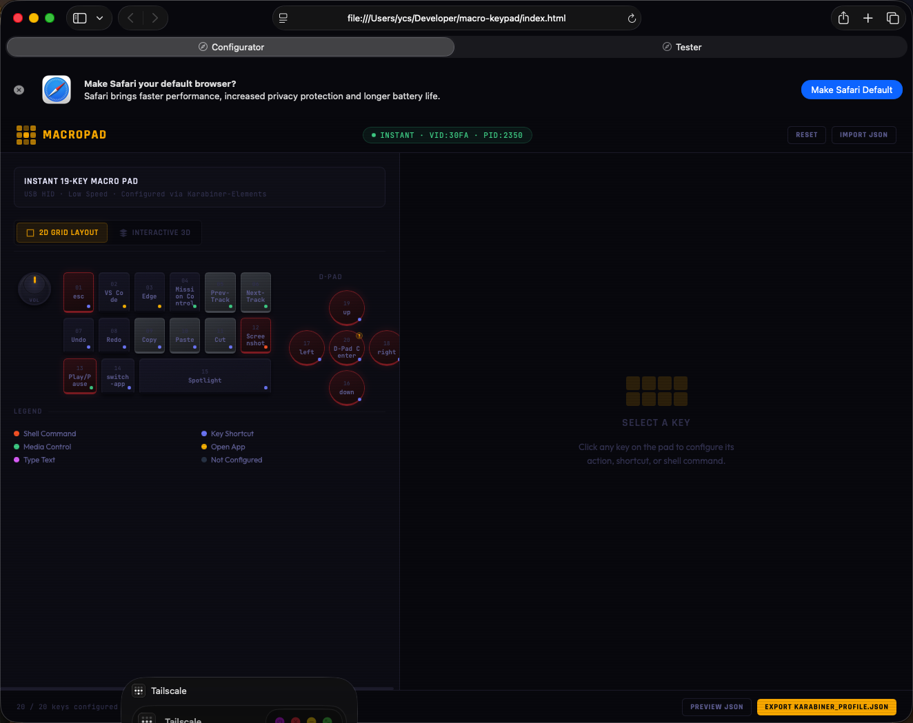
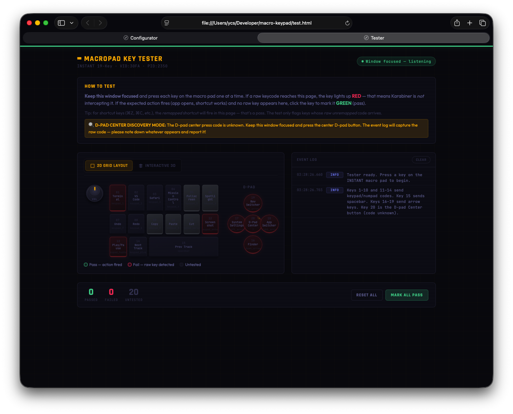

<div align="center">


# MacroPad

**Native macOS driver & configurator for the INSTANT K809 USB-C 20-key macro keypad**

[](https://www.apple.com/macos/)
[](https://v2.tauri.app/)
[](https://www.rust-lang.org/)
[](https://github.com/ycs-mb/macro-keypad-mac-driver/releases/latest)
[](#)

[**⬇ Download MacroPad v1.2.0**](https://github.com/ycs-mb/macro-keypad-mac-driver/releases/latest/download/MacroPad_1.2.0_universal.dmg)
&nbsp;·&nbsp;
[**📖 Full Documentation**](https://github.com/ycs-mb/macro-keypad-mac-driver/wiki)

> The K809 has **no official macOS driver**. MacroPad gives it one — a native `.app` that configures all 20 keys visually, installs the Karabiner-Elements profile with one click, and monitors device connection in the menu bar.

</div>

---

## Prerequisites

> **MacroPad requires [Karabiner-Elements](https://karabiner-elements.pqrs.org/) to be installed and running.**

```bash
brew install --cask karabiner-elements
```

Launch Karabiner-Elements once after installing to initialise it and grant permissions. → [Detailed installation guide](https://github.com/ycs-mb/macro-keypad-mac-driver/wiki/Installation)

---

## Install MacroPad

1. **[Download MacroPad_1.2.0_universal.dmg](https://github.com/ycs-mb/macro-keypad-mac-driver/releases/latest/download/MacroPad_1.2.0_universal.dmg)** (Universal — Apple Silicon + Intel)
2. Open the DMG → drag **MacroPad.app** to `/Applications`
3. **Right-click → Open** on first launch (bypasses Gatekeeper for unsigned app)
4. Click the menu bar icon → **Open MacroPad** → Configurator → **⚡ Apply to Karabiner**

---

## Preset Profiles

MacroPad ships with seven built-in profiles. Switch in the profile bar at the top of the Configurator.

| Profile | Best for |
|---|---|
| **Default** | General use — media, clipboard, shortcuts |
| **Developer** | VS Code, terminal, IDE navigation |
| **Creative** | Figma / Photoshop — layers, groups, transforms |
| **Media** | Playback, volume, brightness |
| **Productivity** | Documents, find, screen capture |
| **Browser** | Tab management, history, bookmarks |
| **Mouse Control** | D-pad drives the mouse pointer — move, click, scroll |

→ [Full profile reference](https://github.com/ycs-mb/macro-keypad-mac-driver/wiki/Preset-Profiles)

---

## Screenshots

### Configurator



### Key Tester



---

## Documentation

| Topic | Link |
|---|---|
| Installation (detailed) | [wiki/Installation](https://github.com/ycs-mb/macro-keypad-mac-driver/wiki/Installation) |
| All action types (Shortcut, App, Media, Shell, Text, Mouse) | [wiki/Key-Configuration](https://github.com/ycs-mb/macro-keypad-mac-driver/wiki/Key-Configuration) |
| Mouse pointer control via D-pad | [wiki/Mouse-Control](https://github.com/ycs-mb/macro-keypad-mac-driver/wiki/Mouse-Control) |
| Preset profiles | [wiki/Preset-Profiles](https://github.com/ycs-mb/macro-keypad-mac-driver/wiki/Preset-Profiles) |
| Key Tester | [wiki/Key-Tester](https://github.com/ycs-mb/macro-keypad-mac-driver/wiki/Key-Tester) |
| Troubleshooting | [wiki/Troubleshooting](https://github.com/ycs-mb/macro-keypad-mac-driver/wiki/Troubleshooting) |
| Architecture | [wiki/Architecture](https://github.com/ycs-mb/macro-keypad-mac-driver/wiki/Architecture) |
| Hardware reference | [wiki/Hardware-Reference](https://github.com/ycs-mb/macro-keypad-mac-driver/wiki/Hardware-Reference) |

---

## Build from source

```bash
cargo install tauri-cli --version "^2" --locked
git clone https://github.com/ycs-mb/macro-keypad-mac-driver.git
cd macro-keypad-mac-driver
cargo tauri dev                                          # dev mode
cargo tauri build --target universal-apple-darwin        # release build
```

---

<div align="center">

Built with [Tauri v2](https://v2.tauri.app/) · [Karabiner-Elements](https://karabiner-elements.pqrs.org/) · Rust · vanilla JS

</div>
