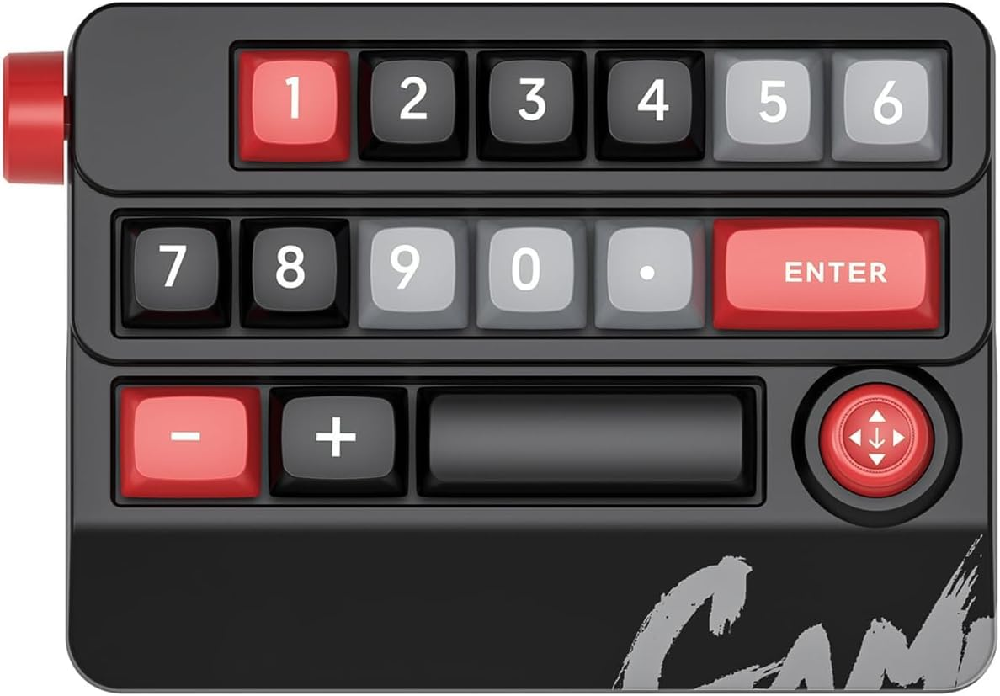
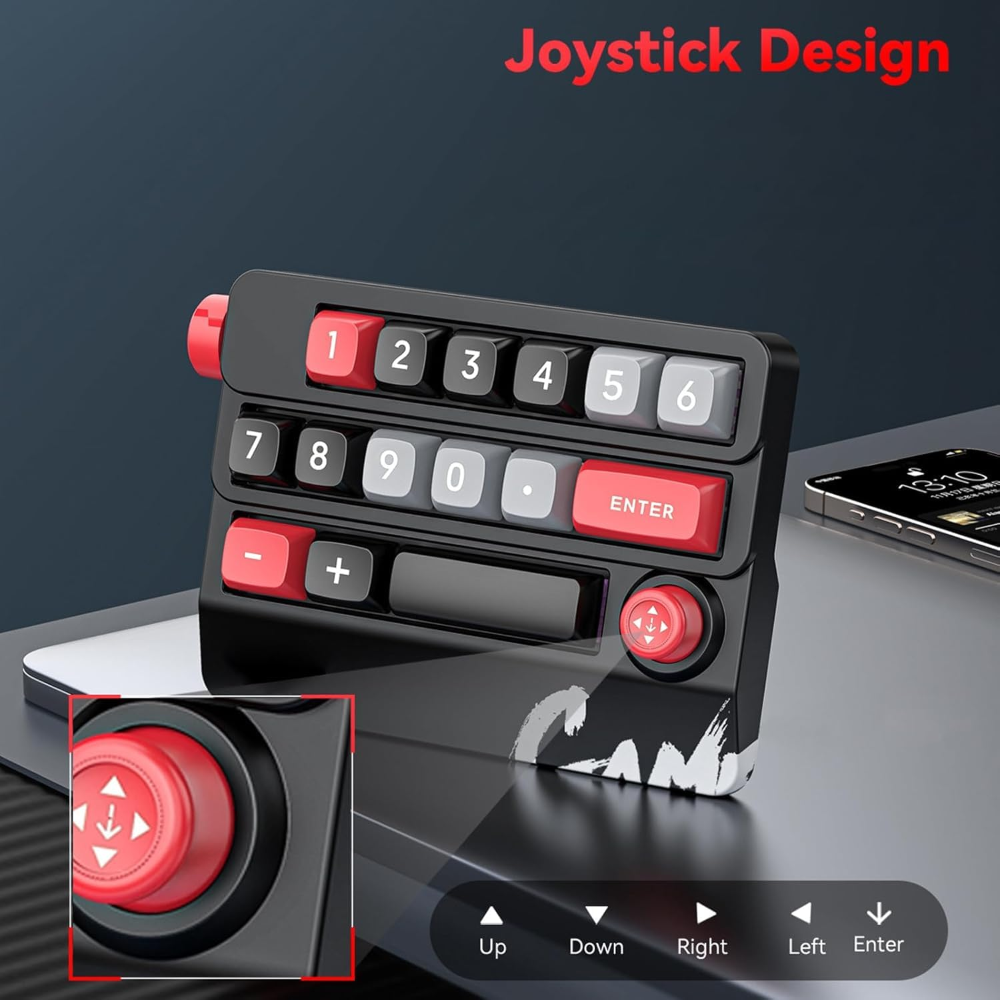
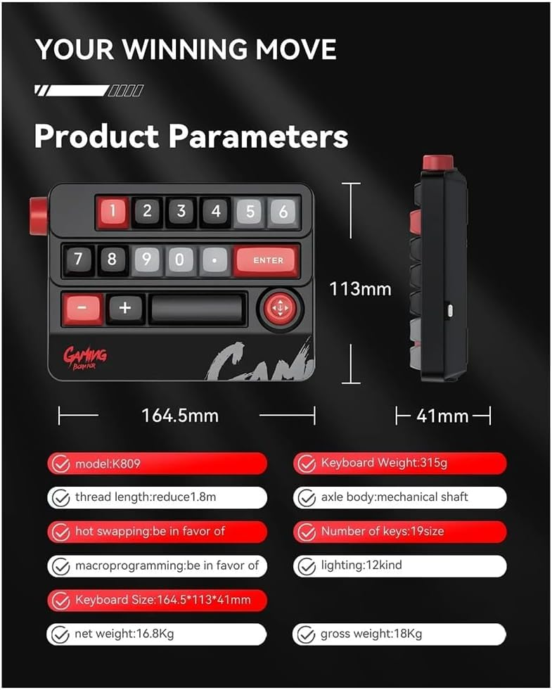

<div align="center">


# MacroPad

**Native macOS driver & configurator for the INSTANT K809 USB-C 20-key macro keypad**

[](https://www.apple.com/macos/)
[](https://v2.tauri.app/)
[](https://www.rust-lang.org/)
[](https://github.com/ycs-mb/macro-keypad-mac-driver/releases/latest)
[](#)

[**⬇ Download MacroPad v1.0.2**](https://github.com/ycs-mb/macro-keypad-mac-driver/releases/latest/download/MacroPad_1.0.2_universal.dmg)

> The K809 has **no official macOS driver**. MacroPad gives it one — a native `.app` that configures all 20 keys visually, installs the Karabiner-Elements profile with one click, and monitors device connection in the menu bar.

</div>

---

## The Device

<div align="center">

</div>

The **INSTANT K809** is a USB-C mechanical macro keypad with:
- **20 programmable keys** across 3 rows + a D-pad cluster
- **Rotary volume knob** with click (hardware volume — no remapping needed)
- **Hot-swappable** mechanical switches, RGB lighting
- **USB HID protocol** — recognized as a standard keyboard, zero driver required at the OS level

Because it speaks HID, macOS *does* detect it — but every key sends generic numpad / arrow codes. Without remapping, nothing does what you want. That's what MacroPad solves.

---

## Screenshots

### Configurator — map every key visually


Click any key on the interactive layout → choose an action (shortcut, app launch, media control, shell command) → hit **⚡ Apply to Karabiner**. Done. No terminal. No JSON editing.

---

### Key Tester — verify every key registers


Each physical key press is detected via browser keyboard events and marked **PASS** (green) or **FAIL** (red). Use this after remapping to confirm all 20 keys fire correctly.

---

## Features

| Feature | Description |
|---|---|
| **Visual configurator** | 2D interactive layout — click a key, pick an action, save |
| **4 action types** | Keyboard shortcut, Open App, Media control, Shell command |
| **⚡ One-click install** | Writes the Karabiner-Elements profile and reloads it — no terminal |
| **Named profiles** | Save multiple key layouts, switch instantly from the profile bar |
| **Key Tester** | Real-time HID event detection with animated key-press feedback and pass/fail tracking |
| **Menu bar icon** | Shows ● (connected) or ○ (disconnected) as K809 is plugged/unplugged |
| **Hide to tray** | Closing the window keeps the app alive in the menu bar |
| **JSON export/import** | Save and share your key profiles as `.json` |
| **Auto-backup** | Every profile write creates a timestamped backup in `~/Library/Application Support/com.macropad.app/backups/` |
| **Resizable panels** | Drag the divider between keypad and config panel to your preferred split |
| **Device-scoped remaps** | Only the K809 is remapped — your regular keyboard is untouched |
| **Universal binary** | Runs natively on Apple Silicon (M1/M2/M3/M4) and Intel x86_64 |

---

## Prerequisites

> **MacroPad requires [Karabiner-Elements](https://karabiner-elements.pqrs.org/) to be installed and running.** MacroPad writes remapping rules into Karabiner's config; without it, no keys will be remapped.

**Install Karabiner-Elements before launching MacroPad:**

```bash
brew install --cask karabiner-elements
```

Or download it directly from [karabiner-elements.pqrs.org](https://karabiner-elements.pqrs.org/).

After installing, **launch Karabiner-Elements at least once** so it creates its config directory and loads its kernel extension. MacroPad will detect it automatically.

---

## Requirements

| Requirement | Details |
|---|---|
| **macOS** | 13.0 Ventura or later |
| **[Karabiner-Elements](https://karabiner-elements.pqrs.org/)** | Required — free, installs via Homebrew or direct download |
| **INSTANT K809** | USB-C macro keypad, VID `0x30FA` / PID `0x2350` |

> **Why Karabiner-Elements?** It's the only macOS tool that can remap keys scoped to a specific device's VID/PID — so your regular keyboard is never affected. MacroPad handles all the JSON configuration automatically; you never need to edit Karabiner's files manually.

---

## Installation

### Step 0 — Install Karabiner-Elements (required)

```bash
brew install --cask karabiner-elements
```

Launch Karabiner-Elements and grant the required permissions (Input Monitoring, kernel extension). You only need to do this once.

---

### Step 1 — Install MacroPad

**Option A — Download the app (recommended)**

1. **[Download MacroPad_1.0.2_universal.dmg](https://github.com/ycs-mb/macro-keypad-mac-driver/releases/latest/download/MacroPad_1.0.2_universal.dmg)** (Universal — Apple Silicon + Intel)
2. Open the DMG → drag **MacroPad.app** to `/Applications`
3. **Right-click → Open** on first launch (bypasses Gatekeeper for unsigned app)
4. The menu bar icon appears — MacroPad is running

**Option B — Build from source**

```bash
# Prerequisites: Rust 1.78+, Tauri CLI v2, Karabiner-Elements
cargo install tauri-cli --version "^2" --locked

git clone https://github.com/ycs-mb/macro-keypad-mac-driver.git
cd macro-keypad-mac-driver

# Run in development mode
cargo tauri dev

# Build universal .app + .dmg
rustup target add aarch64-apple-darwin x86_64-apple-darwin
cargo tauri build --target universal-apple-darwin
```

---

## How to Use

### 1. Configure your keys

<div align="center">

</div>

1. **Open MacroPad** (click the menu bar icon → *Open MacroPad*)
2. Switch to the **Configurator** tab
3. **Click a key** on the interactive layout — it highlights yellow
4. In the right panel, choose an action type:
   - `Key Shortcut` — any key combination (e.g. ⌘⇧4 for screenshot)
   - `Open App` — launch any `.app` by name (e.g. `VS Code`, `Finder`)
   - `Media Control` — play/pause, skip, volume, Mission Control
   - `Shell Command` — run any bash command
5. Click **⚡ Apply to Karabiner** — profile is written and activated immediately

The **keypad/config split** is resizable — drag the vertical divider to give more room to either panel.

---

### 2. Manage profiles

The **profile bar** sits just below the header and lets you maintain multiple key layouts:

| Action | How |
|---|---|
| **Switch profile** | Select from the dropdown — keys load instantly |
| **Save current layout** | Click **Save as…**, type a name, press Enter or **Save** |
| **Delete a profile** | Select it in the dropdown, click **Delete** |

Profiles are stored in `localStorage` and survive app restarts. The last active profile is restored automatically on launch. The **Default** profile cannot be deleted.

---

### 3. Test your keys

1. Switch to the **Key Tester** tab
2. Press each physical key on the K809
3. Each key lights up with an **animated press effect** — green = PASS, red = FAIL
4. The event log shows the raw key code received

---

### 4. Export / import profiles

- **Export** → saves `karabiner_profile.json` to your Downloads folder (or via save dialog)
- **Import** → loads any previously exported `.json` profile back into the configurator
- Profiles are also persisted to `~/Library/Application Support/com.macropad.app/profile.json`

---

### 5. Menu bar

The menu bar icon shows connection status at a glance:

| Tooltip | Meaning |
|---|---|
| `MacroPad ● K809 Connected` | K809 is plugged in and active |
| `MacroPad ○ K809 Disconnected` | K809 is unplugged |

Closing the main window keeps the app alive in the menu bar so it can monitor device status.

---

## Default Key Layout

<div align="center">

</div>

| Key | Sends | Default Action |
|-----|-------|----------------|
| 1 | `keypad_1` | Escape |
| 2 | `keypad_2` | Open VS Code |
| 3 | `keypad_3` | Open Browser |
| 4 | `keypad_4` | Play / Pause |
| 5 | `keypad_5` | Previous Track |
| 6 | `keypad_6` | Next Track |
| 7 | `keypad_7` | ⌘Z — Undo |
| 8 | `keypad_8` | ⌘⇧Z — Redo |
| 9 | `keypad_9` | ⌘C — Copy |
| 10 | `keypad_0` | ⌘V — Paste |
| 11 | `keypad_period` | ⌘X — Cut |
| 12 | `keypad_enter` | Screenshot (interactive) |
| 13 | `keypad_hyphen` | Mission Control |
| 14 | `keypad_plus` | ⌘⇧. — Show hidden files |
| 15 | `spacebar` | ⌘Space — Spotlight |
| 16–19 | Arrow keys | D-pad navigation |
| 20 | *(unknown)* | D-pad center press |
| Knob ← | `volume_decrement` | Volume down (native) |
| Knob → | `volume_increment` | Volume up (native) |

All actions are fully customisable in the Configurator.

---

## Architecture

```
MacroPad.app (Tauri v2)
├── Frontend — macOS WKWebView
│   ├── Tab Router (JS)        — switches Configurator / Tester
│   ├── Configurator View      — key editing, named profiles, JSON export/import
│   └── Tester View            — HID event detection, animated key feedback, pass/fail
└── Backend — Rust
    ├── Karabiner Manager      — reads/writes ~/.config/karabiner/karabiner.json
    ├── USB HID Monitor        — polls K809 VID/PID every 2s via hidapi
    ├── System Tray            — menu bar icon, connected/disconnected tooltip
    └── Profile Store          — ~/Library/Application Support/com.macropad.app/
```

**IPC commands** (Tauri `invoke()`):

| Command | What it does |
|---|---|
| `install_profile` | Backup + inject manipulators into Karabiner config + reload |
| `save_profile` | Persist current mappings to Application Support |
| `export_json` | Return current profile as JSON string |
| `import_json` | Load a profile from external JSON |
| `get_device_status` | Check if K809 is currently connected |
| `get_karabiner_status` | Check Karabiner-Elements install state |

---

## How it works under the hood

macOS TCC blocks direct HID reads from user space. Instead, MacroPad uses **Karabiner-Elements** `complex_modifications` with a `device_if` condition:

```json
{
  "conditions": [{
    "type": "device_if",
    "identifiers": [{ "vendor_id": 12538, "product_id": 9040 }]
  }],
  "from": { "key_code": "keypad_1" },
  "to":   [{ "shell_command": "open -a 'Visual Studio Code'" }]
}
```

This scopes every remap to VID `0x30FA` / PID `0x2350` only — pressing the same key on any other keyboard does nothing.

Connection monitoring uses the [`hidapi`](https://crates.io/crates/hidapi) Rust crate polling every 2 seconds, emitting a `device_status` boolean event to the frontend.

Named profiles are stored in the browser's `localStorage` (WKWebView-scoped) and loaded on startup. When you hit **⚡ Apply to Karabiner**, the active profile's key mappings are serialised into Karabiner `complex_modifications` JSON and written atomically, with a timestamped backup of the previous config.

---

## Troubleshooting

| Symptom | Fix |
|---|---|
| Keys do nothing after install | Open Karabiner-Elements → Devices → confirm **Modify events** is ON for "USB Keyboard (INSTANT)" |
| "Karabiner CLI not found" error | Install or reinstall Karabiner-Elements: `brew install --cask karabiner-elements` |
| Karabiner not detecting the device | Unplug and replug the K809; check Karabiner-Elements → Devices tab |
| App blocked by Gatekeeper | Right-click → Open on first launch (app is unsigned) |
| Menu bar icon not appearing | Quit and relaunch; check that macOS tray is not hidden |
| Profile not persisting after relaunch | Profiles live in WKWebView `localStorage` — ensure the app closes normally (quit from tray, not force-quit) |
| Key 20 (D-pad center) not working | Raw keycode is still unidentified — use Karabiner EventViewer to discover it, then add manually |

---

## Development

```bash
# Run tests (Rust unit tests)
cargo test --manifest-path src-tauri/Cargo.toml

# Run Python integration tests (41 tests)
uv run python3 test_macropad.py

# Dev mode (hot-reload frontend, Rust rebuilds on save)
cargo tauri dev
```

**Project structure:**

```
.
├── src/                        # Frontend (WKWebView)
│   ├── index.html              # Tab router shell (Configurator / Tester tabs)
│   ├── configurator.html       # Key configurator UI — profiles, 2D/3D view, export/import
│   ├── tester.html             # Key tester UI — animated press feedback, pass/fail log
│   └── tauri-bridge.js         # Tauri IPC wrapper (iframe-aware, window.parent fallback)
├── src-tauri/src/              # Rust backend
│   ├── lib.rs                  # Tauri app entry, run()
│   ├── karabiner.rs            # Karabiner config manager (backup + patch + reload)
│   ├── hid_monitor.rs          # USB device polling via hidapi
│   ├── commands.rs             # #[tauri::command] IPC layer
│   ├── tray.rs                 # Menu bar icon + connection status
│   └── profile_store.rs        # Application Support persistence
├── karabiner_profile.json      # Default 20-key remap profile
├── install_profile.sh          # Shell installer (invoked by Rust backend)
└── test_macropad.py            # 41-test verification suite
```

---

## Hardware Reference

<div align="center">

</div>

| Spec | Value |
|---|---|
| Model | INSTANT K809 |
| Connection | USB-C (1.8m detachable cable) |
| Keys | 20 mechanical + D-pad (5 directions) + rotary encoder |
| Dimensions | 164.5 × 113 × 41 mm |
| Weight | 315g |
| VID / PID | `0x30FA` / `0x2350` |
| Protocol | USB HID — standard keyboard class |

---

<div align="center">

Built with [Tauri v2](https://v2.tauri.app/) · [Karabiner-Elements](https://karabiner-elements.pqrs.org/) · Rust · vanilla JS

</div>
