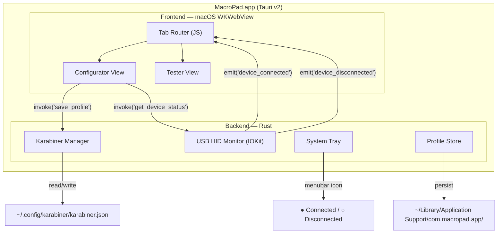
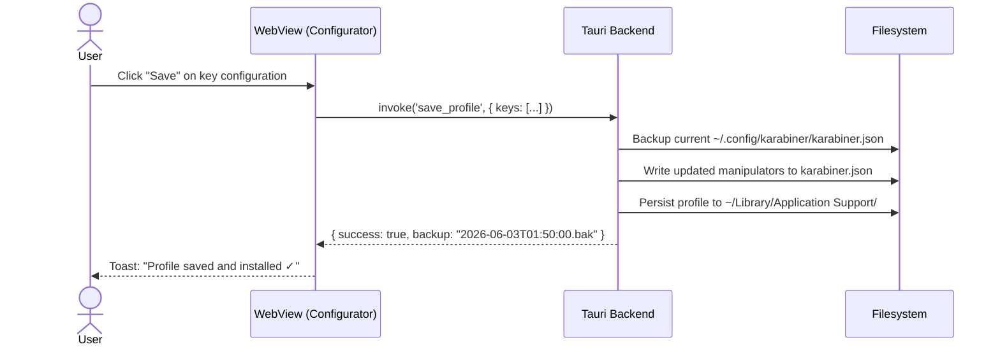

# ADR-001: Native Mac App for K809 Macro Keypad Configurator

| Field | Value |
|---|---|
| **Status** | Accepted |
| **Date** | 2026-06-03 |
| **Decision Makers** | @ycs |
| **Scope** | Full product — packaging, distribution, and platform integration |

---

## Context

The K809 Macro Keypad project currently consists of:

- **Two single-file HTML UIs** (`index.html` for key configuration, `test.html` for HID event testing) with interactive 3D CSS models, totaling ~137KB of self-contained code.
- **A Flask server** (`server.py`) that provides JSON export/import and shell command execution from the browser UI.
- **Shell scripts** (`install_profile.sh`, `watch_and_install.sh`) that inject Karabiner profile JSON into the live system config.
- **A Python test suite** (`test_macropad.py`) with 41 automated tests covering JSON structure, key code validity, round-trip export/import, and live config sync.

The current workflow requires users to:
1. Clone the repository
2. Run `python3 server.py` in a terminal
3. Open `index.html` in a browser
4. Manually execute `install_profile.sh` or use the server's shell execution endpoint

**Problem:** This workflow is viable for a developer but unacceptable for distributing to other K809 macro pad owners who expect a drag-and-drop `.app` experience with zero terminal interaction.

---

## Decision

**Build a native macOS application using Tauri v2 (Rust backend + macOS native WebView frontend), wrapping the existing HTML/CSS/JS codebase with minimal refactoring.**

---

## Alternatives Considered

### Option A: Tauri + Vanilla JS (Selected ✓)

Wrap the existing `index.html` and `test.html` directly inside Tauri's native macOS WebView. The Rust backend handles USB HID monitoring via `IOKit`, Karabiner config file writes, and system tray integration. The frontend JS communicates with the Rust backend through Tauri's `invoke()` IPC bridge.

| Attribute | Value |
|---|---|
| Code reuse | ~90% of existing HTML/CSS/JS |
| Binary size | ~5–8 MB `.dmg` |
| Runtime memory | ~30–50 MB |
| Backend language | Rust |
| WebView | macOS native WKWebView (no bundled browser) |

### Option B: Tauri + Vite Frontend Rewrite (Rejected)

Scaffold a new Vite + vanilla JS (or React) frontend from scratch, cherry-picking the configurator and tester logic into modular components. Cleaner long-term architecture, but rewrites ~70% of working code for marginal architectural benefit at this scale. Doubles initial development time.

### Option C: Electron + Node.js (Rejected)

Use Electron with the existing HTML files. Node.js backend handles file writes and HID monitoring via the mature `node-hid` library.

| Attribute | Value |
|---|---|
| Binary size | ~150–200 MB `.dmg` (30× larger than Tauri) |
| Runtime memory | ~300 MB+ at idle |
| Ecosystem | Largest community, easiest debugging |

**Rejected because:** A 200MB download and 300MB idle memory footprint is disproportionate for a utility app that configures 20 keys. The K809 target audience expects a lightweight tool, not a full Chromium instance.

### Option D: SwiftUI Native (Rejected)

Fully native Mac app built from scratch in Swift/SwiftUI. Cleanest macOS integration (Cocoa menus, system preferences pane, notarization).

**Rejected because:** Requires rewriting all UI and business logic in Swift. The existing 137KB of battle-tested HTML/CSS/JS (including the interactive 3D model, key coordinate mappings, Karabiner JSON generation, and import/export flows) would need to be reimplemented from zero. The ROI does not justify the effort for v1.0.

---

## Architecture

### Component Responsibilities

| Component | Responsibility |
|---|---|
| **Tab Router** | Client-side JS router switching between Configurator and Tester views within a single window |
| **Configurator View** | Key action configuration, JSON export/import, profile management (migrated from `index.html`) |
| **Tester View** | HID event detection, pass/fail key tracking, event logging (migrated from `test.html`) |
| **Karabiner Manager** | Reads/writes `~/.config/karabiner/karabiner.json`, injects/removes manipulator rules scoped to VID `0x30FA` / PID `0x2350`, creates timestamped backups before writes |
| **USB HID Monitor** | Background thread using macOS `IOKit` framework to detect USB device attach/detach events for the K809. Emits events to the frontend via Tauri's event system |
| **System Tray** | Menubar icon showing device connection status (green/gray dot). Dropdown: "Open Configurator", "Device Status", "Quit" |
| **Profile Store** | Persists user profiles, key mappings, and backups in `~/Library/Application Support/com.macropad.app/` following macOS conventions |

### IPC Bridge (Tauri Commands)

The Flask server (`server.py`) is fully replaced by Rust `#[tauri::command]` functions:

| Rust Command | Replaces | Purpose |
|---|---|---|
| `save_profile(json)` | `POST /save` | Write key mappings to profile store |
| `install_profile()` | `POST /run-command` + `install_profile.sh` | Inject profile into live Karabiner config |
| `export_json() → String` | `GET /export` | Return current profile as JSON string |
| `import_json(json)` | `POST /import` | Load a profile from external JSON |
| `get_device_status() → bool` | (new) | Check if K809 is currently connected |
| `get_karabiner_status() → Status` | (new) | Check if Karabiner-Elements is installed and profile is active |

### Data Flow: Key Configuration Save

---

## v1.0 Feature Scope

| Feature | Included | Notes |
|---|---|---|
| Key Configurator | ✅ | Full key action editing, JSON export/import |
| Key Tester | ✅ | HID event detection, pass/fail tracking |
| One-click Karabiner install | ✅ | No terminal needed |
| USB device auto-detection | ✅ | IOKit background monitor |
| Menubar tray icon | ✅ | Connection status + quick actions |
| Interactive 3D CSS viewport | ❌ v1.1 | Deferred — verify WKWebView CSS 3D compat first |
| Karabiner auto-install prompt | ❌ v1.1 | Guide users to install Karabiner if missing |

---

## Distribution

| Attribute | Decision |
|---|---|
| **Channel** | GitHub Releases (`.dmg` download) |
| **Code signing** | Unsigned initially — users right-click → Open on first launch |
| **Target arch** | Universal binary (arm64 + x86_64) via `--target universal-apple-darwin` |
| **Auto-update** | Tauri's built-in updater (JSON endpoint on GitHub Pages) — v1.1 |
| **Cost** | Free — no Apple Developer Program ($99/yr) required for GitHub distribution |

---

## Risks and Mitigations

| Risk | Impact | Mitigation |
|---|---|---|
| macOS WKWebView CSS 3D rendering differences | 3D keycap model may render differently than Chrome | Defer 3D viewport to v1.1; test in WKWebView during development; fall back to 2D grid if needed |
| Karabiner-Elements not installed on user's machine | App cannot function without it | Detect on startup, show guided install instructions with `brew install --cask karabiner-elements` |
| macOS Gatekeeper blocks unsigned app | Users see "app can't be opened" dialog | Document right-click → Open workaround in README; consider signing in v1.1 |
| IOKit USB monitoring requires entitlements | App may need special permissions for HID access | Tauri supports macOS entitlements in `tauri.conf.json`; test with sandboxed and non-sandboxed builds |
| Rust IOKit FFI complexity | USB detection code is non-trivial | Use `core-foundation` and `io-kit-sys` crates which provide safe Rust bindings |

---

## Hardware Compatibility

| Attribute | Value |
|---|---|
| **Minimum macOS** | 13.0 (Ventura) — Tauri v2 requirement |
| **Architectures** | Apple Silicon (M1/M2/M3/M4) + Intel x86_64 |
| **Tested on** | Mac M2, 8GB Unified Memory |
| **Device** | INSTANT K809 USB-C Macro Keypad (VID: `0x30FA`, PID: `0x2350`) |

---

## Success Criteria

1. A K809 owner downloads a single `.dmg` file (<10MB), drags it to `/Applications`, and launches it.
2. The app detects the plugged-in K809 automatically and shows a green status indicator.
3. The user configures all 20 keys visually, clicks "Save & Install", and the Karabiner profile is active immediately — zero terminal interaction.
4. The Key Tester tab verifies all physical keys register correctly with pass/fail tracking.
5. The menubar icon persists after the main window is closed, showing device connection status.

---

## References

- [Tauri v2 Documentation](https://v2.tauri.app/)
- [PROJECT_SUMMARY.md](file:///Users/ycs/Developer/macro-keypad/PROJECT_SUMMARY.md) — current project state
- [index.html](file:///Users/ycs/Developer/macro-keypad/index.html) — configurator UI (source for WebView migration)
- [test.html](file:///Users/ycs/Developer/macro-keypad/test.html) — tester UI (source for WebView migration)
- [karabiner_profile.json](file:///Users/ycs/Developer/macro-keypad/karabiner_profile.json) — active 20-key profile
