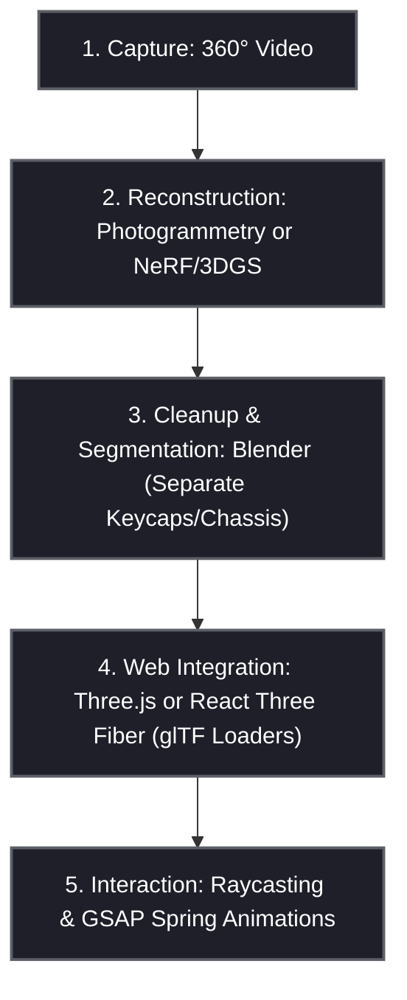

This is an excellent architectural concept. Recreating the physical macro pad from a real-world capture using modern 3D web technologies is the standard for high-end product configurators and interactive experiences.

Here is a structured engineering plan to achieve this, broken down by phases, including the tools, pipelines, and trade-offs.

---



---

### Phase 1: Capture & Reconstruction (Real-World to 3D)

A raw 360° video is a flat raster format; it must be converted into a spatial 3D asset. There are two primary avenues:

1. **3D Gaussian Splatting (3DGS) / NeRFs (Modern, High Fidelity):**
   - **Workflow:** Walk slowly around the keyboard recording a high-quality video (4K, 60fps) with consistent lighting. Process the video using a tool like **Polycam**, **Luma AI**, or **Nerfstudio** to generate a 3D Gaussian Splat (`.ply` file).
   - **Pros:** Captures photorealistic light reflections, metallic sheen, and fine dust textures with near-perfect accuracy.
   - **Cons:** Rendering splats in the browser requires specialized loaders (e.g., Luma's WebGL Splat loader) and high GPU overhead.
2. **Photogrammetry (Mesh-Based - Recommended for Interactivity):**
   - **Workflow:** Capture overlapping static images (or extract frames from the 360° video). Process them in photogrammetry software (e.g., **RealityCapture**, **Meshroom**, or **Polycam**) to construct a dense 3D polygon mesh and high-resolution texture map.
   - **Pros:** Produces standard geometries that are fully compatible with web formats (`.gltf`/`.glb`).

---

### Phase 2: Segmentation & Optimization (Asset Preparation in Blender)

A raw scanned model is a single continuous mesh. To animate individual button presses, the model must be prepared:

1. **Mesh Segmentation:**
   - Import the scanned mesh into **Blender**.
   - Manually cut out the **19 keycaps**, **1 rotary knob**, and the **chassis** into separate, distinct named objects (e.g., `Mesh_Key_01`, `Mesh_Knob`, `Mesh_Chassis`).
   - Clean up the bottom edges of the keycaps so they are hollow or flat.
2. **Origin Alignment:**
   - Move the pivot point (origin) of each keycap object to its local base. When we animate a keypress down, it needs to translate relative to its own local Z-axis.
3. **Decimation & PBR Baking:**
   - Scanned meshes have millions of polygons, which will crash mobile browsers. Use **Decimate Modifiers** in Blender to reduce the polygon count while keeping the keycap shapes crisp.
   - Bake high-poly details into low-poly meshes using **Normal Maps**.
   - Export the unified model as a single optimized binary glTF file (`.glb`) using **Draco Compression** (reducing file size from ~150MB down to <3MB).

---

### Phase 3: Web 3D Canvas Rendering (Three.js / WebGL / WebGPU)

To display the `.glb` model in the web browser, we transition from pure CSS 3D to a standard WebGL canvas:

1. **Core Scene Setup:**
   - Implement **Three.js** (or **React Three Fiber** if using React) inside a `<canvas>` element.
   - Configure a renderer with `antialias: true`, `physicallyCorrectLights: true`, and an `OrbitControls` module for orbital dragging.
2. **Lighting & Shadows:**
   - Add a directional light source matching the top-left shading.
   - Set up **Shadow Maps** (`DirectionalLight.shadow`) to cast realistic shadows from the keys onto the chassis.
3. **GLTFLoader:**
   - Load the `.glb` file. Traverse the model to store references to the individual keycap objects:
     ```javascript
     const loader = new GLTFLoader();
     let keys = {};
     loader.load("macropad.glb", (gltf) => {
       scene.add(gltf.scene);
       gltf.scene.traverse((node) => {
         if (node.isMesh && node.name.startsWith("Mesh_Key_")) {
           keys[node.name] = node;
         }
       });
     });
     ```

---

### Phase 4: Interactivity & Springs (GSAP & Raycasting)

Animating a natural, mechanical keypress requires smooth interpolation:

1. **Raycasting (Mouse Hover & Click):**
   - Use a `Three.Raycaster` to project a laser from the user's cursor coordinates into the 3D scene. Detect intersection with any of the segmented keycap meshes on hover or click.
2. **Animation Engine (GSAP / Spring Physics):**
   - For the visual mechanical keypress action, avoid linear animations. A physical switch has spring resistance and elastic rebound.
   - Use **GSAP (GreenSock)** with a custom ease, or **React Spring** (or a simple physics-based Euler integration in the render loop) to animate the local coordinate position:
     ```javascript
     // Trigger press action
     gsap.to(keycapMesh.position, {
       z: -0.15, // press down locally
       duration: 0.08,
       ease: "power2.out",
       onComplete: () => {
         // Springs back up
         gsap.to(keycapMesh.position, {
           z: 0,
           duration: 0.15,
           ease: "elastic.out(1, 0.4)", // Satisfying elastic rebound bounce
         });
       },
     });
     ```
3. **Reactive RGB LED Lights:**
   - Place a low-intensity point light source inside the chassis directly beneath each translucent/hollowed keycap. On key press, increase the light's intensity and color dynamically to simulate realistic keycap backlighting!

---

### Technical Trade-Offs: CSS 3D vs. WebGL Photogrammetry

| Feature            | Current Pure CSS 3D Model                     | Reconstructed 3D Canvas Model (WebGL)                    |
| :----------------- | :-------------------------------------------- | :------------------------------------------------------- |
| **Download Size**  | **Extremely Low (~10KB)** — immediate loading | **Medium (3MB - 10MB)** — requires loading bar           |
| **Visual Realism** | Stylized Vector Cyber-Aesthetic               | Photorealistic (real-world plastic, metal, and textures) |
| **Performance**    | Ultra-smooth 60fps (Native CSS compositing)   | Dependent on device GPU (CPU/GPU bound)                  |
| **Dependencies**   | **Zero** — 100% offline, vanilla HTML/CSS     | Requires libraries (Three.js, GLTFLoader, Draco)         |
| **Maintenance**    | Code-heavy math layout structures             | Assets-heavy pipelines (Blender asset files)             |
